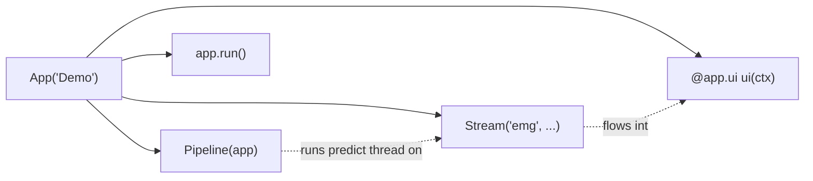

# Anatomy of a MyoGestic app

Read this first. The deep-dive concept pages (Streams, Pipeline, Recording, Widgets) explain *each part* of the framework in detail; this page explains *how the parts fit together* in the order you write them.

By the end, the 35-line script below will read like prose. Open it in your editor and read alongside.

```python
from myogestic import App, Stream, TrainingData
from myogestic.ml import Pipeline, save_pickle, load_pickle
from myogestic.ml.widgets import PipelinePanel
from myogestic.session import iter_labeled_windows
from myogestic.sources import LSLSource
from myogestic.widgets import RecordingControls, SessionManager, SignalViewer
from sklearn.linear_model import LogisticRegression
import numpy as np

app = App("EMG Demo")
app.streams(Stream("emg", source=LSLSource("EMG"), window_ms=200))

pipeline = Pipeline(app, predict_hz=20)
pipeline.save_model = save_pickle
pipeline.load_model = load_pickle


@pipeline.extract
def extract(windows):
    return windows["emg"].mean(axis=1)


@pipeline.train
def train(data: TrainingData):
    X, y = [], []
    for window, _ts, c in iter_labeled_windows(data.paths, "emg", 200, 100, classes=data.classes):
        X.append(extract({"emg": window}))
        y.append(c)
    return LogisticRegression().fit(np.array(X), np.array(y))


@pipeline.predict
def predict(model, features):
    return {"class": int(model.predict(features.reshape(1, -1))[0])}


emg_viewer = SignalViewer("emg")
rec_controls = RecordingControls(
    ["Rest", "Fist"], on_record=app.start_recording, on_stop=app.stop_recording
)
sessions = SessionManager("sessions", class_names=["Rest", "Fist"])
ml_panel = PipelinePanel(pipeline)


@app.ui
def ui(ctx):
    emg_viewer.ui(ctx)
    rec_controls.ui(ctx)
    pipeline.training_data = sessions.ui()
    ml_panel.ui()


app.run()
```

## The shape

A MyoGestic app is **one [`App`][myogestic.App] object**, with **[streams][myogestic.Stream]** flowing through it, optionally **a [`Pipeline`][myogestic.ml.Pipeline]** that adds ML lifecycle, and a **`@app.ui` callback** that draws widgets every frame. `app.run()` boots threads and blocks on the GUI loop. That is the whole skeleton; everything else is variation.



## Imports, in three layers

```python
from myogestic import App, Stream, TrainingData            # the orchestrator + data primitives
from myogestic.ml import Pipeline, save_pickle, load_pickle # ML lifecycle layer (opt-in)
from myogestic.session import iter_labeled_windows         # session reading helpers
from myogestic.sources import LSLSource                    # one of the built-in sources
from myogestic.widgets import RecordingControls, SessionManager, SignalViewer  # ImGui widget classes
from sklearn.linear_model import LogisticRegression        # YOUR ML library
```

Three layers, from framework-owned to user-owned:

1. **Framework primitives** (`App`, `Stream`, `Pipeline`, `TrainingData`) - what you compose.
2. **Built-in capabilities** (`sources`, `widgets`, `ml`, `session`) - what you wire in.
3. **Your domain code** (sklearn, MyoVerse, scipy, PyTorch, ...) - what you bring.

The framework deliberately ships nothing at layer 3 - DSP, ML models, feature extraction are user concerns. See [Design principles](concepts/design-principles.md).

## `App` - the orchestrator

```python
app = App("EMG Demo")
```

One per process. [`App`][myogestic.App] owns the GUI loop, the shared [`Context`][myogestic.Context], the run-loop lifecycle hooks, and the recording state machine. Construct it, then attach things (streams, widgets, optional pipeline), then call `app.run()`.

`App` is **not** a base class to subclass. There is no `class MyApp(App):`. You compose by *attaching*, not *inheriting*.

→ Deep dive: [Architecture](concepts/architecture.md), [Design principles](concepts/design-principles.md).

## `Stream` - the data plumbing

```python
app.streams(Stream("emg", source=LSLSource("EMG"), window_ms=200))
```

A [`Stream`][myogestic.Stream] wraps a [`Source`](concepts/streams.md) plus a fixed-memory ring buffer. Each stream owns one daemon acquisition thread that polls the source, appends to the buffer, refreshes the display snapshot, and (when `app.start_recording()` is active) writes to a Zarr array.

Two reads come out the other side:

- `stream.get_window()` returns the most recent `window_ms` of data, **channels-first** `(n_channels, n_samples)`. This is what feature extractors and ML models consume.
- `stream.get_display(n_pixels)` returns a min/max envelope decimated for rendering. This is what [`SignalViewer`][myogestic.widgets.SignalViewer] consumes.

[`app.streams(*streams)`][myogestic.App.streams] registers one or more. The same method takes any `Source` implementation, so swapping [`LSLSource`][myogestic.sources.LSLSource] for [`ReplaySource`][myogestic.sources.ReplaySource] (offline replay) or your own custom source changes one line.

→ Deep dive: [Streams](concepts/streams.md).

## `Pipeline` - the optional ML lifecycle

```python
pipeline = Pipeline(app, predict_hz=20)
pipeline.save_model = save_pickle
pipeline.load_model = load_pickle
```

[`Pipeline(app)`][myogestic.ml.Pipeline] adds:

- A predict thread that fires every `1/predict_hz` seconds.
- Two new states (`training`, `predicting`) joined to the app's `idle ↔ recording` state machine.
- Three function-decorator slots (`extract`, `train`, `predict`) for your code.

If your app is *just* recording and visualisation, skip the `Pipeline`. If it does ML, attach one.

`save_model` / `load_model` are plain attribute slots. Setting them turns on the **Save Model** / **Load Model** buttons in the ML widgets. The default [`save_pickle`][myogestic.ml.save_pickle] / [`load_pickle`][myogestic.ml.load_pickle] round-trip anything pickleable.

→ Deep dive: [Pipeline](concepts/pipeline.md).

## `@pipeline.extract` - feature extraction

```python
@pipeline.extract
def extract(windows):
    return windows["emg"].mean(axis=1)
```

Receives a dict keyed by stream name. Each value is **channels-first** `(n_channels, n_samples)`. Return whatever your model wants to consume - a feature vector, a tuple, the raw window. Whatever you return becomes the `features` argument to `predict()`.

The same function runs from inside `train()` over recorded windows, and on the predict thread over live windows. **Same code, two call sites.**

## `@pipeline.train` - training

```python
@pipeline.train
def train(data: TrainingData):
    X, y = [], []
    for window, _ts, c in iter_labeled_windows(data.paths, "emg", 200, 100, classes=data.classes):
        X.append(extract({"emg": window}))
        y.append(c)
    return LogisticRegression().fit(np.array(X), np.array(y))
```

Runs on a one-shot training thread when the user clicks **Train**. Receives [`TrainingData`][myogestic.TrainingData] (with `paths`, `class_names`, `classes`) populated by [`SessionManager`][myogestic.widgets.SessionManager]. Return any object - it lands on `pipeline.model` and stays there.

[`iter_labeled_windows`][myogestic.session.iter_labeled_windows] does the heavy lifting of opening sessions (folder or `.session.zip`), walking the label track, and slicing trials into overlapping windows. You only write the feature extraction.

→ Deep dive: [Pipeline](concepts/pipeline.md), [Recording](concepts/recording.md).

## `@pipeline.predict` - live prediction

```python
@pipeline.predict
def predict(model, features):
    return {"class": int(model.predict(features.reshape(1, -1))[0])}
```

Fires once per `1/predict_hz` while the user is in **Predict** mode. **Must return a `dict[str, Any]`**; the result lands in `pipeline.predictions` for widgets to read.

If you push to outputs (LSL, robots, VHI), do it inside `predict()` before returning. The output thread takes the latest pushed value and drains it at its own rate.

## `@app.ui` - the rendering surface

```python
emg_viewer = SignalViewer("emg")
rec_controls = RecordingControls(
    ["Rest", "Fist"], on_record=app.start_recording, on_stop=app.stop_recording
)
sessions = SessionManager("sessions", class_names=["Rest", "Fist"])
ml_panel = PipelinePanel(pipeline)


@app.ui
def ui(ctx):
    emg_viewer.ui(ctx)
    rec_controls.ui(ctx)
    pipeline.training_data = sessions.ui()
    ml_panel.ui()
```

The `@app.ui` callback runs on the **main thread** every frame. The function body is a flat sequence of widget calls; each widget is a stateless function that draws ImGui commands from `ctx` (and arguments).

Three things live here:

1. **Display widgets** ([`SignalViewer`][myogestic.widgets.SignalViewer]) - render data from `ctx.streams`.
2. **Control widgets** ([`RecordingControls`][myogestic.widgets.RecordingControls], [`PipelinePanel`][myogestic.ml.widgets.PipelinePanel]) - fire callbacks to mutate state (start recording, train, predict).
3. **Bridge widgets** ([`SessionManager`][myogestic.widgets.SessionManager]) - return a `TrainingData` you assign to `pipeline.training_data`. This is how UI selection feeds into ML training.

For grid layouts use [`Grid`][myogestic.Grid] and `with grid[r, c]:`. For pop-out windows use `App(docking=True) + app.popout(...)`.

→ Deep dive: [Widgets](concepts/widgets.md).

## `app.run()` - the blocking event loop

```python
app.run()
```

Last line of every script. In order:

1. Starts each `Stream`'s acquisition thread.
2. Fires `before_run_hooks` (where `Pipeline` registers its predict thread).
3. Hands control to the GUI event loop on the main thread - **blocks here**.
4. On window close, runs `cleanup_hooks`, then stops all streams and bridges.

`app.run(mode="gui")` is the default; `mode="headless"` skips the GUI and runs the threads only (useful for unattended recording).

→ Deep dive: [Architecture](concepts/architecture.md), [Threading](concepts/threading.md).

## What's not in this script

- **Recording.** Streams *flow* whether you record or not. Recording starts when [`app.start_recording()`][myogestic.App.start_recording] is called (typically from the [`RecordingControls`][myogestic.widgets.RecordingControls] widget's **Record** button). See [Recording](concepts/recording.md).
- **Outputs.** This skeleton predicts a class index but doesn't push to anything physical. Add an [`LSLOutlet`][myogestic.outputs.LSLOutlet], [`UDPOutput`][myogestic.outputs.UDPOutput], `SerialOutput`, or your own subclass and call `outlet.push(value)` from `predict()`. See [Add a custom output](how-to/add-an-output.md).
- **Multi-stream.** A second `Stream("imu", ...)` and your `extract()` sees `windows["imu"]` too. Match the [`iter_aligned_windows`][myogestic.session.iter_aligned_windows] pattern in `train()` for paired primary/target streams. See [Recording](concepts/recording.md).
- **Bridges.** Heavy-data sources (webcam, ultrasound) run as subprocesses via [`app.bridges(...)`][myogestic.App.bridges]. See [Threading](concepts/threading.md).

## Where to read next

You now have the skeleton. The deep-dive concept pages add the meat:

- [Streams](concepts/streams.md) - ring buffer geometry, the channels-first contract, `get_display` decimation.
- [Pipeline](concepts/pipeline.md) - state machine, decorator semantics, stale-tick guards.
- [Recording](concepts/recording.md) - sessions, label tracks, the `.session.zip` archive.
- [Widgets](concepts/widgets.md) - the stateless-function pattern, `Grid` layout, pop-out windows.
- [Architecture](concepts/architecture.md) - the runtime architecture (which thread runs what, the data flow diagram).
- [Threading](concepts/threading.md) - GIL release, GPU contention rule, bridge subprocesses.
- [Design principles](concepts/design-principles.md) - the eight rules the framework keeps to.

Or jump straight into a hands-on walkthrough: the [EMG classification tutorial](tutorials/emg-classification.md) builds on this skeleton with real features, real data, and a real model.
