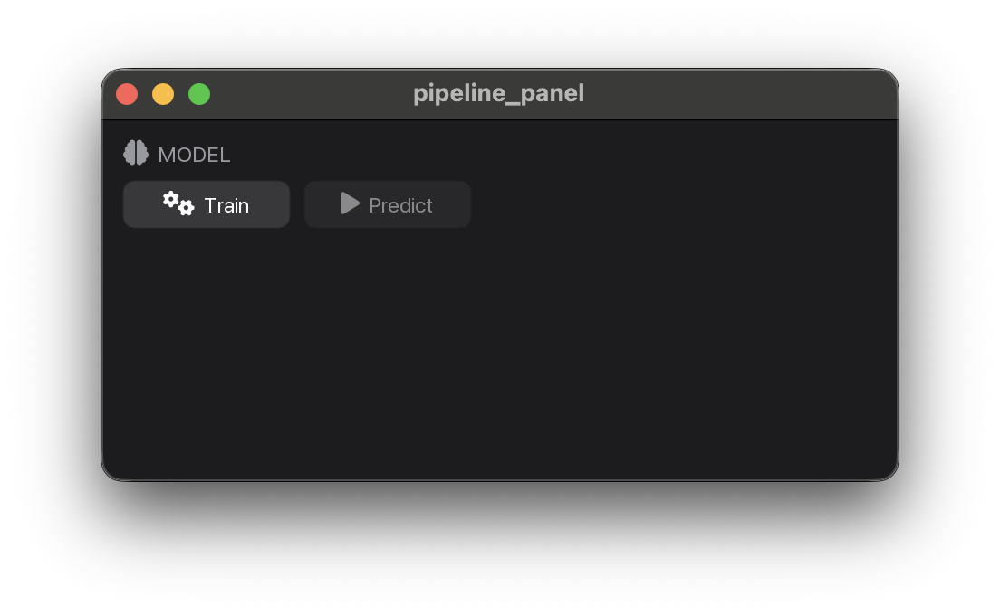

# ML pipeline

## Pipeline

::: myogestic.ml.Pipeline
    options:
      summary:
        functions: true
        attributes: true

::: myogestic.ml.PipelineState

## Persistence

::: myogestic.ml.save_pickle

::: myogestic.ml.load_pickle

## Widgets

::: myogestic.ml.widgets.TrainButton

::: myogestic.ml.widgets.PredictButton

::: myogestic.ml.widgets.TrainingLog

::: myogestic.ml.widgets.SaveModelButton

::: myogestic.ml.widgets.LoadModelButton

---

::: myogestic.ml.widgets.PipelinePanel

{ loading=lazy }
