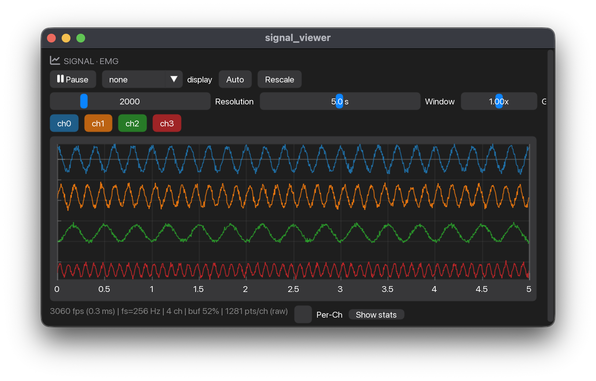
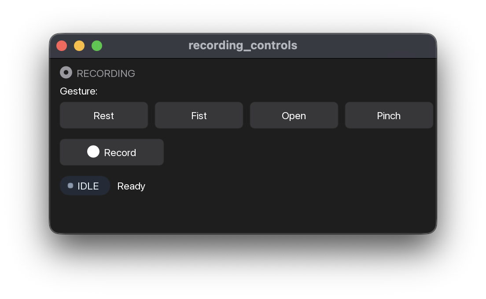
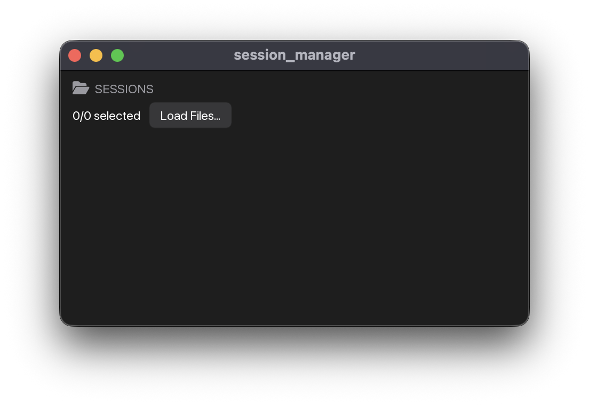
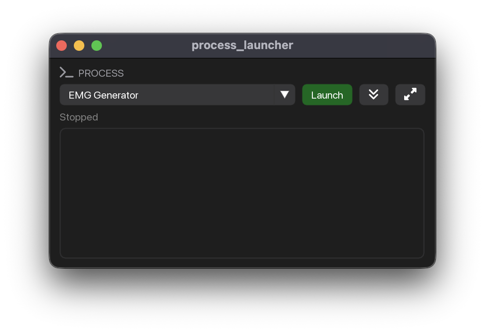
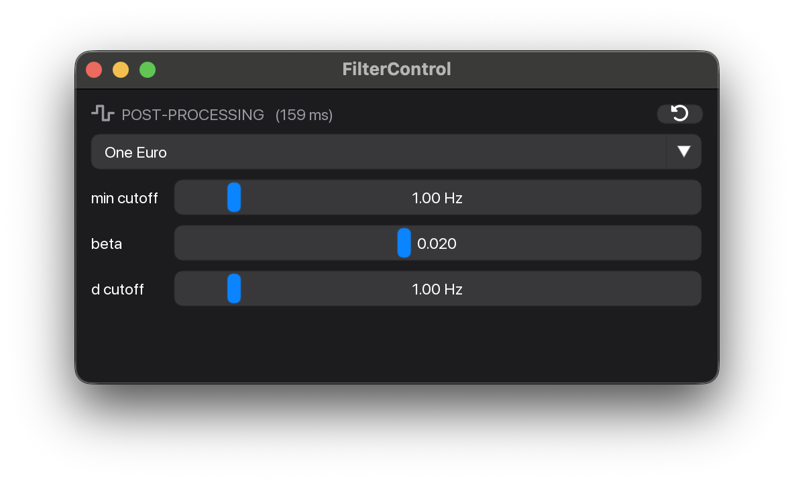
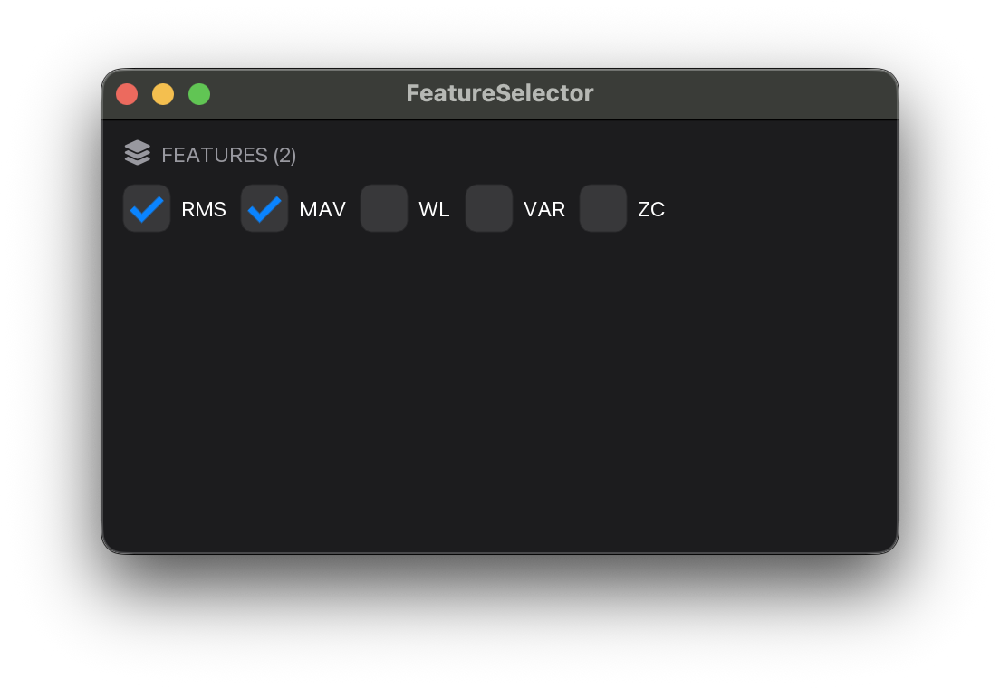
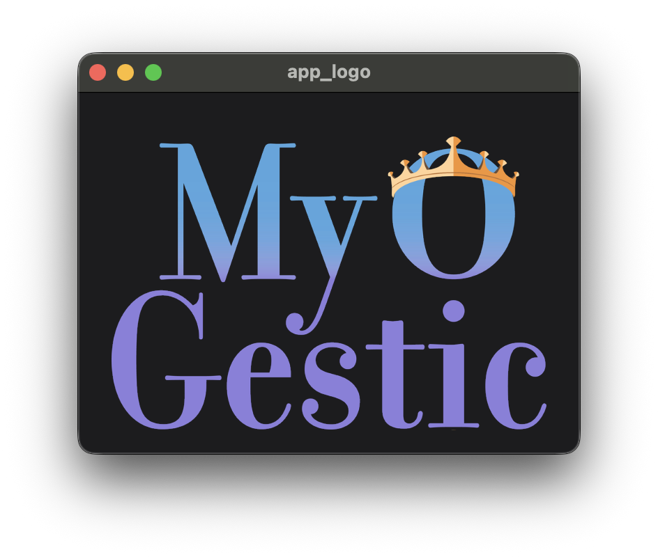
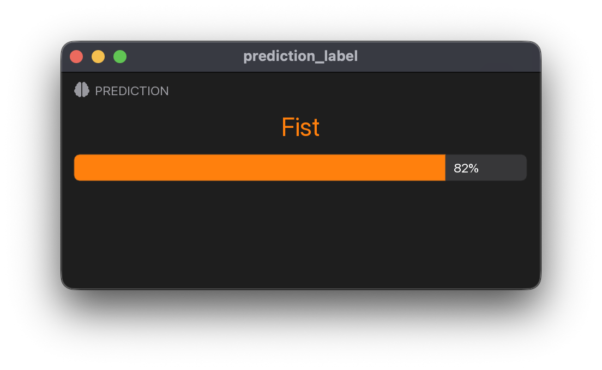
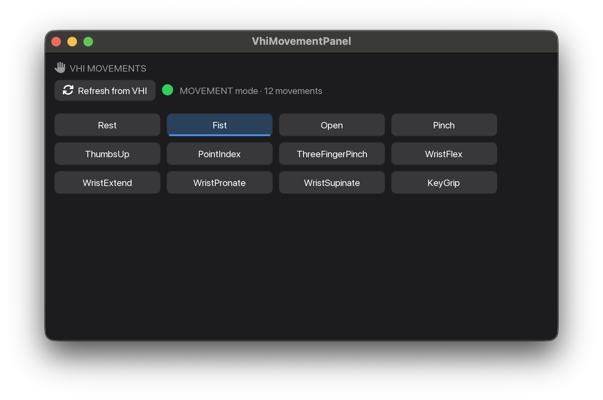

# Widgets

Widget classes you construct once and render with `.ui(...)` from inside `@app.ui`. See the [Widgets concept page](../concepts/widgets.md) for the contract and the [widget gallery](../widget-gallery.md) for a visual index of all of them on one page.

## Signal viewers

::: myogestic.widgets.SignalViewer

{ loading=lazy }

::: myogestic.widgets.RawSignalViewer

## Device selection

::: myogestic.widgets.DevicePicker

### Describing a device

`DEFAULT_DEVICES` covers the shipped amplifiers. Build a `DeviceSpec` only for hardware the picker does not already list.

::: myogestic.widgets.DeviceSpec

::: myogestic.widgets.DeviceOption

::: myogestic.widgets.DeviceParam

::: myogestic.widgets.signals.device_picker.DEFAULT_DEVICES

::: myogestic.widgets.signals.device_picker.OTB_DEVICES

::: myogestic.widgets.signals.device_picker.LSL_DEVICE

::: myogestic.widgets.signals.device_picker.SYNTHETIC_DEVICE

## Recording and sessions

::: myogestic.widgets.RecordingControls

{ loading=lazy }

::: myogestic.widgets.RecordButton

::: myogestic.widgets.StreamManager

::: myogestic.widgets.SessionManager

{ loading=lazy }

## Force tracking

See [Track a force target](../how-to/track-a-force-target.md) for the whole loop, including how the transducer reaches the stream and why calibration takes two captures.

::: myogestic.widgets.TrackingTask

## Task trajectories

What a subject is asked to follow. `myogestic.tracking` is plain data — no ImGui, nothing that talks to a device — so the same trajectory can be evaluated in a test, in an offline script and by whatever draws it, with no second implementation to drift. `TrackingTask` forwards every edit to the [`TargetSource`][myogestic.sources.TargetSource] it was handed, so what is drawn and what is recorded cannot diverge.

`Trajectory` is the structural protocol the two shapes satisfy by having its three members, not by inheriting anything. They differ in unit and in what they are for: `Trapezoid` is percent of MVC for [isometric force tracking](../how-to/track-a-force-target.md); `Pursuit` is signed `[-1, +1]` control units for [proportional-control training](../how-to/record-for-proportional-control.md), and it exists because a block cueing only Down / Rest / Up asks for three distinct target values, so what a fit produces between them comes from the estimator rather than from the recording — for the tree ensembles shipped here, nothing at all.

::: myogestic.tracking.Trajectory

::: myogestic.tracking.Trapezoid

::: myogestic.tracking.Pursuit

::: myogestic.tracking.Calibration

## Proportional-control game

::: myogestic.widgets.PongTask

The command is signed: `+1` is the top of the court, `-1` the bottom, and `-1` is a real value rather than the absence of `+1`. The widget is only the game — it reads no stream, no session and no model, so whatever produces the float (a decoder, a force channel, a slider) stays the app's business. [`examples/start_here/pong.py`](https://github.com/NsquaredLab/MyoGestic/blob/main/examples/start_here/pong.py) drives it from a [`directional_decoder`][myogestic.recipes.estimators.directional_decoder]; [`examples/panels/pong.py`](https://github.com/NsquaredLab/MyoGestic/blob/main/examples/panels/pong.py) drives it from a slider.

`control` decides what the command *does*, and neither mode is right in general. `"velocity"`, the default, integrates it, which turns even a three-output decoder into a complete controller — up / hold / down reach every height in the court — at the cost of accumulating the decoder's resting bias. The dead zone it carries slows that and does not stop it — a *constant* command inside the band integrates to nothing, but bias plus ordinary noise rectifies to something positive and walks the paddle onto a wall in tens of seconds while the subject holds still, so expect them to be correcting and press Serve to recentre. `"position"` maps the command onto the paddle's travel, the full range across the full travel: it cannot drift, and where the paddle sits is what the model just emitted scaled to the court, which makes it the honest mode to debug against and the better one once the command is genuinely continuous.

`ui(command, target=…)` draws a **ghost paddle** for that command — the reference a subject tracks while a training block records, typically [`Pursuit.value_at`][myogestic.tracking.Pursuit.value_at]. `target` is in the same signed `[-1, +1]` as `command`, not a court coordinate: it is mapped onto the paddle's travel by the same line `control="position"` uses, so a subject sitting on the ghost has produced exactly the number the session recorded. The ghost does not play the ball and is not a second player. Generating the trajectory and recording against it belong to the app, not the widget.

Without `opponent` the far wall simply returns the ball, and the score is hits against misses. Pass `opponent` and a second paddle plays it back, with each side's points drawn on its own half — the same rally, now with something to win. One number sets the whole difficulty: it is that paddle's top tracking speed as a multiple of `ball_speed`, so `opponent=0.6` covers a little over half the court while the ball crosses and `opponent=1.0` covers more than all of it.

## Process management

::: myogestic.widgets.ProcessLauncher

{ loading=lazy }

## Plotting

::: myogestic.widgets.Scatter2D

::: myogestic.widgets.Scatter3D

::: myogestic.widgets.Heatmap

::: myogestic.widgets.LinePlot

## Output processing

::: myogestic.widgets.PostProcessor

{ loading=lazy }

::: myogestic.widgets.FilterProcessor
    options:
      summary:
        functions: true
        attributes: true

::: myogestic.widgets.FilterSpec

::: myogestic.widgets.FilterParam

## Feature selection

::: myogestic.widgets.FeatureSelector

{ loading=lazy }

## Training and inspection

::: myogestic.widgets.TemplateInspector

::: myogestic.widgets.training.template_inspector.TemplateInspectorRow

::: myogestic.widgets.TrialPreview

## Layout helpers

::: myogestic.widgets.panel_header

::: myogestic.widgets.popout_panel

## Status and logs

::: myogestic.widgets.StreamPanel

::: myogestic.widgets.LogPanel

## Branding

::: myogestic.widgets.Image

::: myogestic.widgets.AppLogo

{ loading=lazy }

## ML readout

::: myogestic.widgets.PredictionLabel

{ loading=lazy }

## Virtual Hand integration

::: myogestic.widgets.vhi.panel.VhiMovementPanel

{ loading=lazy }

### Lower-level pieces

`VhiMovementPanel` wraps these for the common case. Reach for them directly when you want to share one state cache across multiple panels, or render the palette without owning a client.

::: myogestic.widgets.vhi.palette.vhi_movement_palette

::: myogestic.widgets.vhi.palette.VhiStateCache

::: myogestic.widgets.vhi.palette.VhiStateSnapshot

::: myogestic.widgets.vhi.palette.request_vhi_state_refresh
