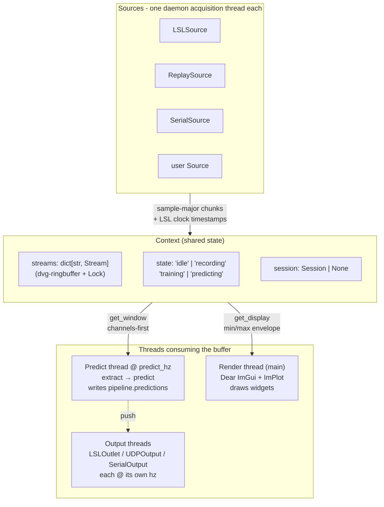

# Architecture

MyoGestic is built around three orthogonal concerns: **acquisition** (sources feeding ring buffers), **decision** (the predict thread), and **rendering** (the main thread drawing widgets). Outputs are a fourth, owned by user code.



## Data flow

A typical tick of the system:

1. **Acquisition thread** for stream `"emg"` reads a chunk from `LSLSource`, appends to the ring buffer, refreshes the display snapshot, and (if `ctx.session` is non-`None`) appends to the active Zarr array.
2. **Predict thread**, once per `1/predict_hz`, pulls a window via `Stream.get_window()` (channels-first), forwards it to `@pipeline.extract`, then to `@pipeline.predict(model, features)`. The returned `dict[str, Any]` is stored in `pipeline.predictions`.
3. **Render thread** (main) draws widgets from `ctx`. `signal_viewer` calls `Stream.get_display(n_pixels)` for a min/max envelope. The pose-output filter (`FilterControl`) renders its panel.
4. **Output thread** for `LSLOutlet` checks its atomic latest-value slot every `1/hz`, sends if changed.

Every box runs on its own daemon thread. The shared `Context` is the only synchronisation surface.

## Module map

| Module | Responsibility |
|--------|----------------|
| [`myogestic.core`](../api/core.md) | `App`, `Context`, lifecycle hooks, run loops |
| [`myogestic.stream`](../api/core.md) | `Stream`, ring buffer, acquisition thread, display snapshots |
| [`myogestic.sources`](../api/sources.md) | `LSLSource`, `ReplaySource`, `SerialSource` |
| [`myogestic.outputs`](../api/outputs.md) | `Output` base + `LSLOutlet`, `UDPOutput`, `SerialOutput` |
| [`myogestic.session`](../api/session.md) | Recording, label tracks, `.session.zip`, window iterators |
| [`myogestic.ml`](../api/ml.md) | `Pipeline`, train/predict lifecycle, ML widgets |
| [`myogestic.recipes`](../api/models.md) | CatBoost / scikit-learn constructor recipes + persistence helpers |
| [`myogestic.widgets`](../api/widgets.md) | Stateless ImGui function widgets |
| [`myogestic.filters`](../api/filters.md) | OneEuro / Gaussian / Identity output smoothers |
| `myogestic.bridges` | Subprocess pattern for heavy-data sources (webcam, ultrasound) |

## Public API boundary

Keep these import paths stable. The internal modules (`myogestic.core`, `myogestic.stream`) are subject to change; user code should import from the package root or named subpackages:

```python
from myogestic import App, Grid, Stream, TrainingData
from myogestic.sources import LSLSource, ReplaySource
from myogestic.outputs import LSLOutlet, UDPOutput
from myogestic.ml import Pipeline
from myogestic.session import open_session_store, iter_labeled_windows
from myogestic.widgets import signal_viewer, recording_controls, session_manager
```

See [Public API cheatsheet](../reference/api-cheatsheet.md) for the full surface.
