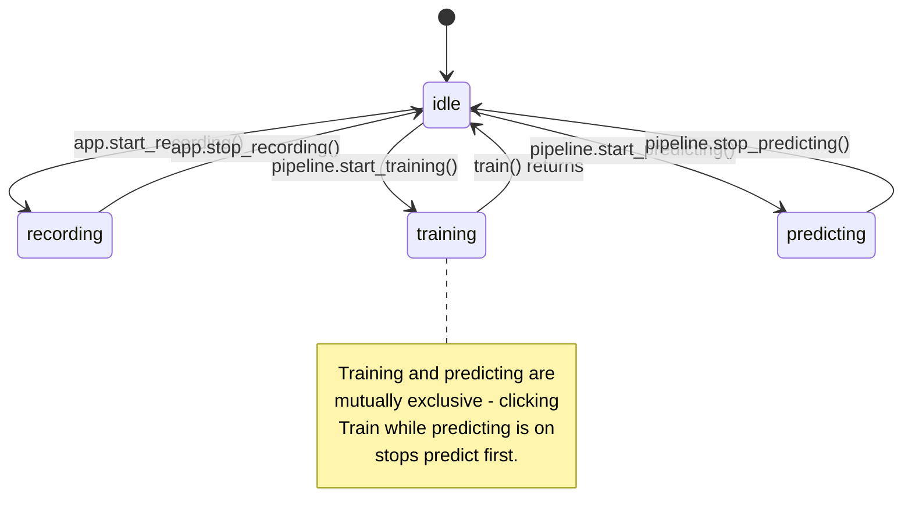

# Pipeline

[`Pipeline(app, predict_hz=50)`][myogestic.ml.Pipeline] is the optional ML layer. It adds a predict thread, training/predicting states to `ctx.state`, and three function decorators that *are* your entire ML surface - no base classes, no registration, no config.

```python
from myogestic.ml import Pipeline, save_pickle, load_pickle

pipeline = Pipeline(app, predict_hz=20)
pipeline.save_model = save_pickle
pipeline.load_model = load_pickle


@pipeline.extract
def extract(windows: dict[str, np.ndarray]):
    return windows["emg"]  # whatever shape downstream wants


@pipeline.train
def train(data: TrainingData):
    rows = iter_labeled_windows(data.paths, "emg", window_ms=200, hop_ms=100)
    X, y = ...  # build feature matrix
    return CatBoostClassifier().fit(X, y)


@pipeline.predict
def predict(model, features):
    pred = model.predict(features.reshape(1, -1))[0]
    return {"class": pred}
```

That's the whole protocol.

## The three decorators

### `@pipeline.extract`

Runs on the predict thread, every `1/predict_hz` seconds. Receives a `dict[str, np.ndarray]` keyed by stream name - each value is **channels-first** `(n_channels, n_samples)`. Return whatever your model wants to consume: a feature vector, a tuple, the raw window, anything pickleable-or-not.

The same callable runs during training, but it's invoked by *user code* inside `train()`, not by the framework. (See the worked examples in `examples/synthetic/emg_classification.py`.)

### `@pipeline.train`

Runs on a one-shot training thread when the user clicks **Train**. Receives one [`TrainingData`][myogestic.TrainingData] instance:

```python
@dataclass
class TrainingData:
    paths: list[str]  # selected session paths (folders or .session.zip)
    class_names: list[str]  # ordered class labels
    classes: set[int]  # subset selected in the UI
```

Return any object - it's stored on `pipeline.model` and forwarded to every subsequent `predict()` call. If `pipeline.save_model` is set, the **Save Model** button calls it as `save_model(pipeline.model, path)`. The persistence helpers [`save_pickle`][myogestic.ml.save_pickle] / [`load_pickle`][myogestic.ml.load_pickle] from `myogestic.ml` are the simplest sane default.

`pipeline.training_data` is set externally - usually from [`SessionManager`][myogestic.widgets.SessionManager] inside `@app.ui`:

```python
sessions = SessionManager(str(Path("sessions")), class_names=CLASSES)
with grid[2, 0]:
    pipeline.training_data = sessions.ui()
```

This separation lets the `Train` button stay disabled until at least one session is ticked.

### `@pipeline.predict`

Runs on the predict thread once the model is loaded and **Predict** is clicked. Receives `(model, features)` where `features` is the return value of `extract()`. **Must return a `dict[str, Any]`** - non-dict returns are silently dropped (the previous prediction stays in `pipeline.predictions`).

Inside `predict()` you typically also push to outputs:

```python
@pipeline.predict
def predict(model, features):
    pose = model.predict(features)
    pose_smooth = pose_filter(pose, timestamp=time.monotonic())
    vhi_outlet.push(pose_smooth)
    return {"pose": pose_smooth}
```

## State machine



Only one state at a time. **Training pauses prediction** (and vice versa) - there's no parallel GPU contention juggling. When the user clicks Train while predict is running, predict stops first; when training completes, the user clicks Predict again to resume.

The user-facing UI layer (`PipelinePanel`, `TrainButton`, `PredictButton`) handles transitions; user code rarely calls `start_training()` / `stop_predicting()` directly.

## Stale-tick guard

The predict thread wakes every `1/predict_hz`, but the acquisition thread might not have new data - the network or device could be slow. Stateful models (state machines, sequence-aware classifiers) need to know when a tick repeats data. The convention:

```python
@pipeline.extract
def extract(windows):
    emg, ts = emg_stream.get_window()
    last_ts = float(ts[-1]) if ts.size > 0 else None
    return (emg, last_ts)


@pipeline.predict
def predict(model, features):
    emg, last_ts = features
    return model.step(emg, last_ts=last_ts)  # model decides if tick is stale
```

A stateful model can use exactly this - its `step()` returns the previous prediction if `last_ts` hasn't advanced since the last call.

## Lifecycle hooks

`Pipeline` registers itself via `app.before_run_hooks` and `app.cleanup_hooks`. The predict thread starts at `app.run()` and runs for the lifetime of the app, but it only does work while `ctx.state == "predicting"` - when the user clicks Predict, the state flips and the thread starts calling `extract` / `predict`; clicking Predict again or closing the window flips it back to idle and the loop short-circuits. Cleanup signals via a `threading.Event` and joins with a short timeout. You don't manage threads yourself.

## Common mistakes

See also: full **[Troubleshooting](../troubleshooting.md)** index, organised by symptom across every subsystem.

- **Returning a non-dict from `predict()`.** Silently dropped. Always return `{"key": value}`.
- **Mutating `pipeline.training_data` outside `@app.ui`.** It can be set anywhere, but most experiments let `SessionManager` write it from the UI.
- **Heavy work inside `extract()` or `predict()`.** They run on the predict thread at `predict_hz`. Keep CPU work bounded; offload long jobs to the training thread.
- **Forgetting `pipeline.save_model = save_pickle`.** The save/load buttons render but do nothing without it.
