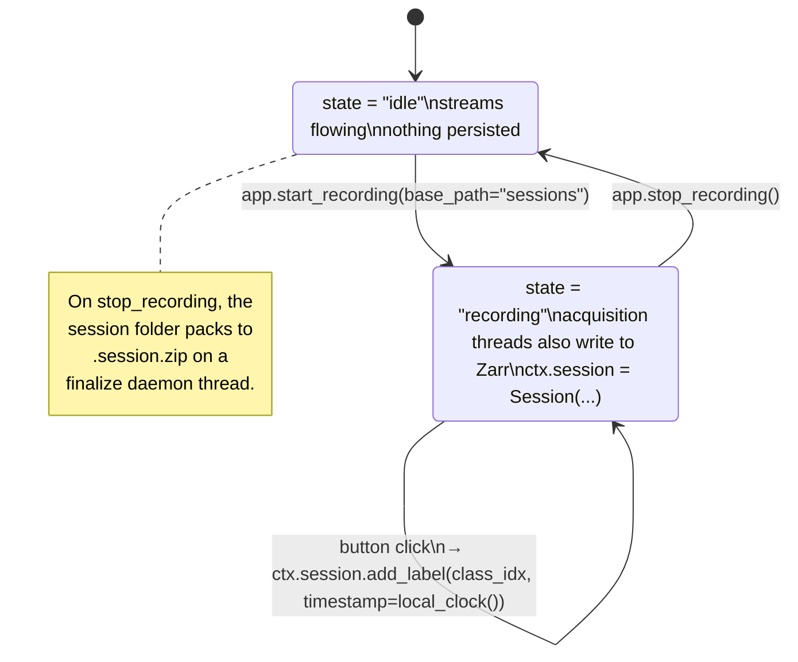

# Recording

Streams always flow. **Recording is just "start appending to Zarr."** Labels are a separate timestamped event track, not interleaved with the signal - that keeps the signal arrays cheap to slice and the labels cheap to scan.

## Mental model



Acquisition threads check `ctx.session is not None` on every chunk; if set, they append to the corresponding Zarr array. Recording adds *no* new threads.

## On-disk layout

During recording, one folder per session:

```text
sessions/
└── 2026-05-06_18-46-47/
    ├── meta.json                   # class_names, started_at, model_meta
    ├── labels.json                 # label_track (timestamps + class indices)
    ├── emg.zarr/                   # (n_samples, n_channels) sample-major
    ├── emg_timestamps.zarr/        # (n_samples,) float64 LSL clock
    ├── imu.zarr/                   # if a second stream was recorded
    └── imu_timestamps.zarr/
```

After `stop_recording`, the folder packs to a single archive:

```text
sessions/
├── 2026-05-06_18-46-47/            # original folder (kept until pack succeeds)
└── 2026-05-06_18-46-47.session.zip # archive - contains the same internal layout
```

Both are loadable via [`open_session_store(path)`][myogestic.session.open_session_store] - readers don't need to know which they got.

## Labels

`LabelEvent` is a tiny dataclass:

```python
@dataclass
class LabelEvent:
    timestamp: float  # pylsl.local_clock() at the button click
    class_index: int  # -1 = unlabeled (terminator)
```

The label track is a list of these events, persisted to `labels.json` on stop. Each consecutive pair `(events[i], events[i+1])` defines one **trial** - every sample in between is labelled `class_index`. The `-1` terminator at the end marks the boundary of the last trial so iterators know where to stop.

[`recording_controls`][myogestic.widgets.recording_controls] writes labels when the user clicks a button:

```python
recording_controls(
    ctx,
    ["Rest", "Fist", "Open"],
    on_record=app.start_recording,
    on_stop=app.stop_recording,
    on_gesture=lambda idx: ctrl_outlet.push_sample([float(idx)]),
)
```

`on_gesture` is yours - typically you forward to a control LSL stream (so a synthetic generator can change pattern), or a robot, or just log it. The label itself is added by `recording_controls` itself before calling your callback.

## Reading recordings

```python
from myogestic.session import open_session_store

sess = open_session_store("sessions/2026-05-06_18-46-47.session.zip")

# Continuous data
data, ts = sess.get_continuous("emg")
# data.shape == (n_samples, n_channels)  - sample-major as recorded

# Per-trial slices (labelled segments)
trials = sess.get_trials("emg", pre_s=0, post_s=0)
# list[Recording] - each has .data, .ts, .class_index, .class_name

# Stream metadata
info = sess.stream_info("emg")  # StreamInfo(n_channels, fs, dtype, channel_names)
```

For training pipelines, two iterators do the slicing for you:

### Classification - [`iter_labeled_windows`][myogestic.session.iter_labeled_windows]

```python
from myogestic.session import iter_labeled_windows

for window, ts, class_idx in iter_labeled_windows(
    data.paths,
    stream_name="emg",
    window_ms=200,
    hop_ms=100,
    classes={0, 1},
):
    feat = rms(window)  # window is (n_channels, n_samples)
    X.append(feat)
    y.append(class_idx)
```

Yields one window per `hop_ms` step, dropping windows that straddle a label boundary so each window has exactly one class. The three-tuple is `(window, ts, class_index)` - `ts` is the matching 1-D timestamp array, in case you need per-sample times for downstream alignment.

### Regression - [`iter_aligned_windows`][myogestic.session.iter_aligned_windows]

```python
from myogestic.session import iter_aligned_windows

for window, aligned, ts in iter_aligned_windows(
    data.paths,
    primary_stream_name="emg",
    aligned_stream_names=["vhi_control"],
    window_ms=200,
    hop_ms=50,
    n_alignment_samples=1,
):
    feat = extract(window)
    target_pose = aligned["vhi_control"]  # shape (n_channels,)
```

Yields the primary window plus a synchronised target snapshot per `aligned_stream_names` entry - handy when the ground truth is a continuous signal (kinematics, torque, joint angles).

## Backends

Zarr is the storage layer. Two compression backends are supported transparently:

- **Pure-Python `zarr`** (default) - works everywhere.
- **`zarrs`** (Rust codec via PyO3, optional via `uv sync --extra zarrs`) - drop-in faster compression for big sessions.

If `zarrs` is installed, the codec is registered on import; if not, recording falls back to plain `zarr` with no code change.

## Common mistakes

See also: full **[Troubleshooting](../troubleshooting.md)** index, organised by symptom across every subsystem.

- **`sess.class_names = [...]` after `save_meta`.** The class names persist only when passed as a kwarg to `save_meta(name, class_names=...)`, not when set as an attribute after the fact. (`recording_controls` handles this for you when it calls `app.start_recording`.)
- **Treating the label track as a stream.** It isn't - it's events. To iterate "rest periods" by time, slice with the labels and the timestamp arrays manually, or use `iter_labeled_windows`.
- **Single-click sessions.** A session with two clicks (Rest + DoF0) yields exactly one usable trial after the skip-first heuristic. Long cycle-style recordings (rest 3 s → DoF 3 s → rest 3 s → DoF 3 s, etc.) yield many trials per session and produce robust models.
