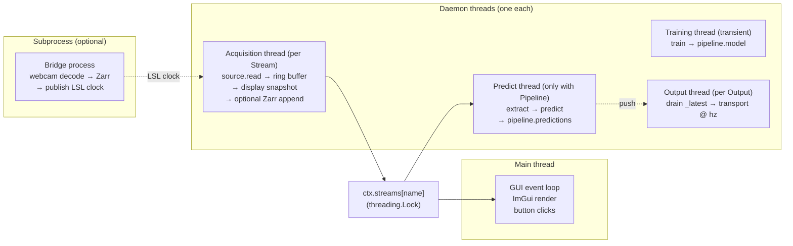

# Threading

stdlib `threading` only. No asyncio, no multiprocessing on the hot path. Subprocess isolation is reserved for "bridges" - heavy-data sources like webcams or ultrasound that would otherwise saturate a thread.

## What runs where



| Thread | Owner | Job |
|--------|-------|-----|
| Main | OS | GUI event loop, ImGui render, button clicks |
| Acquisition (one per `Stream`) | `Stream` | source.read → ring buffer → display snapshot → optional Zarr append |
| Predict | `Pipeline` | extract → predict → write to `pipeline.predictions` |
| Training (transient) | `Pipeline` | train → assign to `pipeline.model` |
| Output (one per `Output`) | user-owned `Output` | drain `_latest` to its destination at `hz` |
| Bridge subprocess (optional) | `Bridge` | webcam decode → Zarr → publish LSL clock |

Every non-main thread is a daemon: the program exits cleanly even if a thread is mid-iteration when the user closes the window. The predict thread is started via `app.before_run_hooks` (at `app.run()`, not on first Predict click) and joined with a short timeout via a `threading.Event` flag on cleanup. Acquisition and output threads are daemons that exit when the process does; their `stop()` methods set a sentinel but don't `join()`.

## Why the GIL doesn't bite

Python's Global Interpreter Lock would be a problem if any of these threads spent CPU time in pure Python. They don't:

- **NumPy** releases the GIL inside C extensions (`np.copy`, `np.fft.rfft`, `np.dot`). The ring buffer copy in `get_window` is GIL-released.
- **PyTorch CUDA** runs on the GPU; the Python thread is mostly waiting for the kernel.
- **LSL** (`pylsl` and `mne_lsl`) is a C library; `pull_chunk` releases the GIL.
- **ImGui / ImPlot** are C++; the render thread spends its time in C++ frame building.
- **OpenCV** (used by `WebCamBridge`) releases the GIL in `cv2.VideoCapture.read`.

The Python interpreter is mostly orchestrating - handing buffers between threads. The actual compute happens in GIL-released code, so the threads run in parallel on multi-core machines.

## Synchronisation

The shared `Context` is the only synchronisation surface, and it relies on three properties:

1. **Reference assignment is atomic in CPython.** `pipeline.model = trained` doesn't tear; readers either see the old reference or the new one. Same for `pipeline.predictions = {...}`.
2. **Ring buffer reads/writes hold a `threading.Lock`.** ~1–5 µs overhead per access - invisible against the µs–ms latencies of real workloads.
3. **`ctx.state` transitions go through `App.start_*` / `App.stop_*`.** Callers don't poke `ctx.state = "..."` directly. State changes are point-in-time; there's no "stop in progress" intermediate state.

No condition variables, no queues, and the only `threading.Event` is the predict thread's shutdown flag. If a thread needs the latest value, it reads the field; if a thread needs to update, it writes the field.

## The GPU contention rule

**Predicting pauses while training runs.** This is a hard rule, not a soft hint:

```text
ctx.state ∈ {"idle", "recording", "training", "predicting"}
                                    │           │
                                    └─ exclusive ┘
```

Click Train while predicting is running → predicting stops first. Training completes → user clicks Predict again to resume.

Why: PyTorch CUDA streams can be juggled, but the engineering complexity isn't worth it for a single-user experiment app. Predict throughput drops to zero during training, which lasts seconds-to-minutes; that's acceptable for the use case. The state machine refuses parallel attempts so you can't accidentally OOM the GPU.

## Bridge subprocesses

Heavy-data sources break the GIL-release assumption - webcam decoding, even with OpenCV, can saturate the Python thread enough to disrupt the predict thread. The escape hatch is a subprocess:

```python
cam = WebCamBridge("cam", device=0, zarr_path="session/cam.zarr")
app.bridges(cam)
```

The bridge process:

- Owns its own Python interpreter (no GIL contention with the main app).
- Writes frames directly to a Zarr array - that's the persistence step.
- Publishes an LSL "clock" stream so the main app knows what frame number is current.

The main app never touches the camera frames; it just reads frame-number stamps from the LSL stream and looks up frames in the Zarr if the experiment needs them. A `ProcessLauncher` panel shows the bridge's start/stop state.

## Common mistakes

See also: full **[Troubleshooting](../troubleshooting.md)** index, organised by symptom across every subsystem.

- **`time.sleep` in `@pipeline.predict`.** It blocks the predict thread. The framework already paces ticks at `predict_hz`; if you need rate-limiting, change `predict_hz` or use a state machine that returns the previous prediction on stale ticks.
- **Touching ImGui from a non-main thread.** ImGui is not thread-safe. Widgets only run inside `@app.ui`, which is the render thread. Predict-thread code must NOT call `imgui.*`.
- **Long blocking I/O inside a Source's `read`.** It pauses the acquisition thread, which pauses ring-buffer updates, which delays prediction. Sources should poll non-blockingly (e.g. `pylsl.pull_chunk(timeout=0.0)`).
- **Holding the ring buffer lock during compute.** The lock is taken inside `get_window` for the copy; release happens before the function returns. User code holds no buffer lock.
