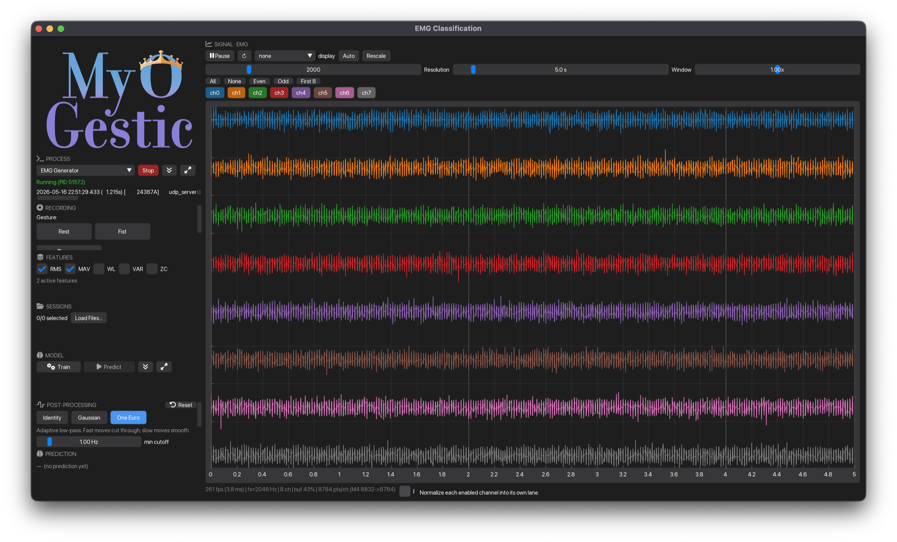

# Getting started

## Install

MyoGestic v2 uses [uv](https://docs.astral.sh/uv/) for environment management. From a fresh clone:

```bash
git clone https://github.com/raulsimpetru/MyoGestic-v2.git
cd MyoGestic-v2
uv sync
```

The base install gives you the framework - sources, widgets, the ML pipeline, the recording layer, and the synthetic EMG generator - without forcing scientific Python heavyweights on you.

Optional extras (pick what you need):

| Extra | What it adds |
|-------|--------------|
| `examples` | `catboost`, `myoverse`, `torch`, `scikit-learn` (so the demos run) |
| `dev` | the above plus `pytest` and `ruff` |
| `serial` | `pyserial` (serial sources/outputs) |
| `grpc` | `grpcio` (gRPC control plane to the Virtual Hand Interface) |
| `bdi` | OT Bioelettronica devices |
| `brainflow` | BrainFlow device support |
| `zarrs` | Rust-accelerated Zarr codec |
| `docs` | `properdocs` + `mkdocs-material` + `mkdocstrings` (this site) |

```bash
uv sync --extra examples   # to run the EMG demos
```

## Run the synthetic-EMG demo

The repository ships a synthetic LSL stream so the demos run without any hardware. **One terminal, then click two buttons in the GUI** - the demo's `process_launcher` panel spawns the generator (and the Virtual Hand) for you.

```bash
uv run python examples/synthetic/emg_classification.py
```

{ loading=lazy }

In the window:

1. Click **Launch** on **EMG Generator** (top-left) - the synthetic 8-channel signal appears in the viewer on the right.
2. *(Optional)* Click **Launch** on **VHI Hand** if `VHI_PATH` and `GODOT_BIN` are set; otherwise the button shows a click-time error and you can ignore it.

The rest of the layout:

- An 8-channel signal viewer filling the right two columns.
- A `Rest`/`Fist` button strip on the left.
- Recording controls, the pipeline panel, the output filter panel, and the session manager - top to bottom on the left.

!!! tip "Running the generator standalone"
    If you'd rather drive the generator from a separate terminal (handy when you want to share one generator across multiple demos), the in-GUI launcher just runs:

    ```bash
    uv run python -m myogestic.tools.emg_generator \
        --name TestEMG1 --channels 8 --fs 256 --classes 2 --control EMG_Control
    ```
    The demo's signal viewer will pick up whichever stream is publishing on the matching name.

## What you just ran

Each thing visible in the window maps directly to one MyoGestic primitive. Once you can map the GUI to the framework, the rest of the docs make a lot more sense.

- **Signal viewer** (right two columns) - a [`signal_viewer`](api/widgets.md) widget reading from a `Stream`. The stream owns the ring buffer; the widget just renders a decimated min/max envelope.
- **Process launchers** (top-left) - the [`process_launcher`](api/widgets.md) widget. Each entry is a subprocess command - here, the synthetic EMG generator and the Virtual Hand.
- **Recording controls** with `Rest` / `Fist` buttons and a Record button - the [`recording_controls`](api/widgets.md) widget. Clicking a button writes a label event; clicking Record toggles `app.start_recording()` / `app.stop_recording()`.
- **Train / Predict / Save / Load** buttons - [`pipeline_panel`](api/ml.md) plus `save_model_button` / `load_model_button`. They drive the `Pipeline` state machine.
- **Post-processing filter panel** - a [`FilterControl`](api/widgets.md) widget. The script also calls it from inside `predict()` to smooth the output vector before pushing.
- **Sessions** - the [`session_manager`](api/widgets.md) widget. It returns a `TrainingData` object the script assigns to `pipeline.training_data`, which is what `@pipeline.train` receives when you click Train.

Want the code-side view of the same thing? Read **[Anatomy of a MyoGestic app](anatomy.md)** - it walks through a complete 35-line script in the order you write it.

## A first experiment

The minimum closed-loop experiment is ~40 lines. Open `examples/synthetic/emg_classification.py` for a walkthrough - see the [EMG classification tutorial](tutorials/emg-classification.md) for a line-by-line read.

## Next steps

- Browse the [tutorials](tutorials/index.md) for end-to-end walkthroughs.
- Read [Concepts](concepts/index.md) to understand streams, the pipeline, and the threading model.
- Skim the [API cheatsheet](reference/api-cheatsheet.md) when you need a quick lookup.
