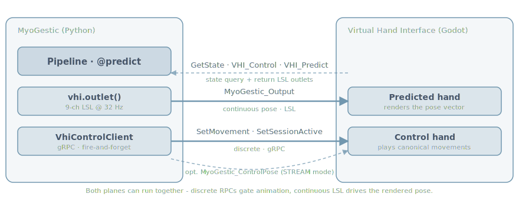

# Integrate the Virtual Hand Interface

The **Virtual Hand Interface (VHI)** is the Godot-based 3-D hand
visualisation that ships alongside MyoGestic. It can be driven on two
planes at once:

* **LSL data plane** - high-rate continuous pose. The 9-channel
  `MyoGestic_Output` outlet streams a `[-1, 1]` pose vector every tick;
  VHI renders it directly on the *predicted hand*.
* **gRPC control plane** - discrete, idempotent control. RPCs like
  `SetMovement`, `SetSessionActive`, `SetControlMode` make the *control
  hand* play canonical movements, freeze, switch modes, or report state
  back to MyoGestic.

You don't have to pick one - most examples use both. Classifier output
becomes a `SetMovement` RPC on class change; regression output streams as
a continuous 9-vec.

{ align=center }

## The one-liner that wires it up

```python
from myogestic.vhi.interfaces import virtual_hand

vhi = virtual_hand()                  # resolves install path + gRPC endpoint
vhi_outlet = vhi.outlet()             # 9-ch LSL outlet @ 32 Hz
vhi_client = vhi.control_client()     # fire-and-forget gRPC client
```

`virtual_hand()` looks at `$VHI_PATH`, the per-user install root, and the
local git checkout in that order. It reads `$VHI_GRPC_HOST` /
`$VHI_GRPC_PORT` for the control endpoint (defaults `127.0.0.1:50051`).
The returned `InterfaceSpec` knows everything - outlet name, channel
count, send rate, gRPC target, launcher argv - so the example code stays
boilerplate-free.

If VHI isn't installed yet, see **[Install the Virtual Hand](install-vhi.md)**.

## Launching the VHI process

Drop the launcher into your `process_launcher` panel and the user gets
a Start/Stop button for VHI:

```python
import sys
from myogestic.widgets import process_launcher

PROCESSES = [
    ("EMG Generator", [sys.executable, "-m", "myogestic.tools.emg_generator",
                       "--name", "TestEMG1", "--channels", "8", "--fs", "2048"]),
    *vhi.launcher(),
]

@app.ui
def ui(ctx):
    with grid[0, 0]:
        process_launcher(PROCESSES)
```

`vhi.launcher()` prefers a packaged binary install when present and
falls back to `godot --path <project>` for source-mode development. Set
`$VHI_LAUNCH_MODE=binary` or `=godot` to force one.

If VHI is not installed, `launcher()` raises `FileNotFoundError` with the
exact `install_vhi` command to run. Surface this as a status message:

```python
try:
    PROCESSES = [*base, *vhi.launcher()]
except FileNotFoundError as e:
    print(f"[demo] {e}", file=sys.stderr)
    PROCESSES = base       # demo still runs; VHI button just absent
```

## Plane 1 - continuous pose over LSL

VHI subscribes to a 9-channel float32 outlet. Channels are interpreted in
`[-1, 1]`:

| Index | Joint              |
|-------|--------------------|
| 0     | Thumb rotation     |
| 1     | Thumb flexion      |
| 2     | Index flexion      |
| 3     | Middle flexion     |
| 4     | Ring flexion       |
| 5     | Little flexion     |
| 6-8   | Wrist (3 axes)     |

`0` is rest, `-1` and `+1` are the joint extremes. Push every predict
tick - `vhi_outlet` runs its own send thread at `hz`, so only the latest
push is sent.

```python
@pipeline.predict
def predict(model, features):
    pose = model.compose_pose(features)            # np.float32, shape (9,)
    vhi_outlet.push(pose)
    return {"pose": pose}
```

Pair it with a smoothing filter - raw model output looks twitchy on a
60 fps render:

```python
from myogestic.widgets import FilterControl
import time

pose_filter = FilterControl(hz=20.0, default="one_euro")

@pipeline.predict
def predict(model, features):
    pose = pose_filter(model.compose_pose(features), timestamp=time.monotonic())
    vhi_outlet.push(pose)
    return {"pose": pose}

@app.ui
def ui(ctx):
    with grid[6, 0]:
        pose_filter.ui()
```

See [Post-process predictions](post-process-output.md) for filter tuning.

## Plane 2 - discrete control over gRPC

For classifier output, the right primitive isn't "push a pose every
tick" - it's "tell VHI to play movement X *when the class changes*". The
gRPC client is the discrete-event sibling of the LSL outlet:

```python
from myogestic.outputs import EdgeTrigger

CLASSES = ["Rest", "Fist", "Pinch", "Point"]

trigger = EdgeTrigger(callback=vhi_client.set_movement)

@pipeline.predict
def predict(model, features):
    class_idx = int(np.argmax(model.predict_proba(features)))
    trigger.fire_if_changed(CLASSES[class_idx])
    return {"class": class_idx}
```

`EdgeTrigger` suppresses the per-tick repeats so the RPC only fires on
the rising edge of a class change. See [the EdgeTrigger
concept](../concepts/edge-trigger.md) for `rebase()` and the
thread-safety story.

The control client is **fire-and-forget**: every method enqueues onto a
daemon thread that issues the unary RPC with a short deadline.
Disconnect errors are de-duplicated and logged once. GUI handlers never
block on a 60 fps render loop.

Useful RPCs:

| Call                                                      | Effect on VHI                                                                 |
|-----------------------------------------------------------|-------------------------------------------------------------------------------|
| `set_movement(name)`                                      | Play movement, snap to end pose and hold.                                     |
| `set_movement(name, cycle=True)`                          | Play full open/close cycle - for **recording regression data**.               |
| `freeze(True / False)`                                    | Pause / resume control-hand animation.                                        |
| `set_session_active(True / False)`                        | Gate VHI's local keyboard control while a MyoGestic session is recording.    |
| `set_control_mode("MOVEMENT" / "STREAM" / "IDLE")`        | Switch the control-hand driver (see "Control-pose streaming" below).         |
| `set_speed(frequency_hz, hold_time_s, rest_time_s)`       | Adjust movement-cycle timing.                                                 |
| `set_smoothing(enabled, smoothing_speed)`                 | Toggle predicted-hand smoothing on the VHI side.                              |
| `set_chirality(right_hand)`                               | Swap to the left-hand model and back.                                         |
| `get_state()`                                             | **Synchronous** - query connection, current movement, available palette.     |

`get_state()` is the one synchronous call. Use it on startup or an
explicit GUI refresh button - never in the render loop.

## A ready-made movement palette

`VhiMovementPanel` packages "fetch state in the background, render the
movement buttons, dispatch clicks through gRPC" into one widget. Drop it
in a grid cell and forget about it:

```python
from myogestic.widgets.vhi.panel import VhiMovementPanel

panel = VhiMovementPanel(vhi_client)

@app.ui
def ui(ctx):
    with grid[8, 0]:
        panel.ui()
```

Pass `on_movement=` to layer a side-effect on click - e.g. snap a
session label, or rebase the predict-side `EdgeTrigger` so the next
tick doesn't re-fire what the button just did:

```python
def _on_movement_click(name: str) -> None:
    vhi_client.set_movement(name)
    trigger.rebase(name)

panel = VhiMovementPanel(vhi_client, on_movement=_on_movement_click)
```

## Control-pose streaming (STREAM mode)

Some workflows - e.g. continuous regression where the control hand is
the *target* - want to drive the control hand from a pose vector instead
of canonical movements. Put VHI into **STREAM** mode and push to the
`MyoGestic_ControlPose` outlet:

```python
control_pose = vhi.control_outlet()       # 9-ch LSL outlet @ 32 Hz
vhi_client.set_control_mode("STREAM")     # SetMovement is rejected in STREAM mode

@some_recording_loop
def recording_tick(pose_target):
    control_pose.push(pose_target)
```

Switch back with `set_control_mode("MOVEMENT")` (the default), or
`"IDLE"` to make the control hand hold rest.

## Testing without VHI

`print` is the cheapest viewer:

```python
@pipeline.predict
def predict(model, features):
    pose = model.compose_pose(features)
    print(f"pose: {[f'{v:+.2f}' for v in pose]}")
    return {"pose": pose}
```

Or attach `pylsl`'s `lslviewer.py` to the `MyoGestic_Output` stream. For
the gRPC plane, the standard `grpcurl` works against the local server
when VHI is running - the proto is at
`myogestic/vhi/_proto/myogestic_vhi.proto`.

## Common mistakes

See the full **[Troubleshooting](../troubleshooting.md)** index for
symptom-organised debugging.

* **Pushing the wrong shape.** VHI expects a 9-vec. `(1, 9)` or any
  other shape breaks the outlet's metadata. Use
  `np.asarray(pose, dtype=np.float32).reshape(9)` if unsure.
* **Re-firing `SetMovement` every tick.** Wrap the call in an
  [`EdgeTrigger`](../concepts/edge-trigger.md). Continuous re-fire is
  harmless for idempotency but re-triggers the animation cycle.
* **Forgetting `set_session_active(False)` on session end.** VHI keeps
  ignoring its own keyboard until you toggle it back.
* **Pushing to `control_outlet()` outside STREAM mode.** VHI ignores
  the stream - switch the mode first.
* **Forgetting `pose_filter.reset()` on retrain.** The first few smoothed
  frames blend the new model's first prediction with the old model's
  last; looks like a brief pose drift on every train cycle.

## See also

* [Install the Virtual Hand](install-vhi.md) - the installer CLI.
* [Edge trigger](../concepts/edge-trigger.md) - fire-on-change pattern.
* [Examples directory](../tutorials/examples-index.md) - every shipped
  example wires VHI either via LSL, gRPC, or both.
* [`myogestic.vhi.interfaces.virtual_hand`](../api/core.md) - full signature.
* [`myogestic.widgets.vhi.panel.VhiMovementPanel`](../api/widgets.md) -
  movement palette API.
