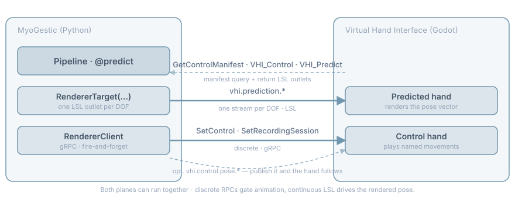

# Integrate the Virtual Hand Interface

The **Virtual Hand Interface (VHI)** is the Godot-based 3-D hand visualisation that ships
alongside MyoGestic. It is a [renderer](build-a-renderer.md) — a separate application, read
from over LSL and commanded over gRPC — and it is the one renderer this project ships with.

So this page is only what is true of *this* renderer: where it is installed, how it is
launched, what it calls its controls, and how to drive its control hand while recording. How
the two planes work at all is [Build a renderer](build-a-renderer.md); what a control map is
and how you declare what you drive is [Concepts › Controls](../concepts/controls.md), with
the full rules in [the control standard](../api/controls.md).

If VHI isn't installed yet, see **[Install the Virtual Hand](install-vhi.md)**.

{ align=center }

## The one-liner that wires it up

```python
from myogestic.vhi import virtual_hand

vhi = virtual_hand()                 # resolves install path + gRPC endpoint
vhi_control = vhi.control_client()   # negotiates the control space (v2)
recording = vhi.recording_client()   # recording session gate + trajectory playback
```

`virtual_hand()` looks at `$VHI_PATH`, the per-user install root, and the local git checkout
in that order. It reads `$VHI_GRPC_HOST` / `$VHI_GRPC_PORT` for the control endpoint
(defaults `127.0.0.1:50051`).

That is the whole VHI-shaped part of pointing MyoGestic at it. The returned
[`InterfaceSpec`][myogestic.renderer.InterfaceSpec] knows *where* VHI is and nothing about
what VHI renders — which controls exist is a running VHI's answer, and each one's stream is
named for its own address, so there is no table on this side to go stale. Handing that spec
and its client to a [`RendererTarget`][myogestic.renderer.RendererTarget] is what asks:

```python
from myogestic.controls import ControlLink
from myogestic.renderer import RendererTarget

link = ControlLink(CONTROL_MAP, [RendererTarget(client=vhi_control, interface=vhi)], hz=32)
```

One target drives the whole map, both hands included; no stream is named and none is
counted. See [Negotiating with the target](../api/controls.md#negotiating-with-the-target)
for what that resolves and what it refuses, and
[Binding is deferred, not decided](../concepts/controls.md#binding-is-deferred-not-decided)
for why a `ControlLink` rather than a bus — an application that launches VHI from its own
button necessarily binds before VHI exists.

## Launching the VHI process

Drop the launcher into your `ProcessLauncher` panel and the user gets
a Start/Stop button for VHI:

```python
import sys
from myogestic.widgets import ProcessLauncher

PROCESSES = [
    ("EMG Generator", [sys.executable, "-m", "myogestic.tools.emg_generator",
                       "--name", "TestEMG1", "--channels", "8", "--fs", "2048"]),
    *vhi.launcher(),
]

launcher = ProcessLauncher(PROCESSES)

@app.ui
def ui(ctx):
    with grid[0, 0]:
        launcher.ui()
```

`vhi.launcher()` prefers a packaged binary install when present and
falls back to `godot --path <project>` for source-mode development. Set
`$VHI_LAUNCH_MODE=binary` or `=godot` to force one.

If VHI is not installed, `launcher()` raises `FileNotFoundError` with the
exact `install_vhi` command to run. Surface this as a status message:

```python
try:
    PROCESSES = [*base, *vhi.launcher()]
except FileNotFoundError as e:
    print(f"[demo] {e}", file=sys.stderr)
    PROCESSES = base       # demo still runs; VHI button just absent
```

## What VHI calls its controls

A running VHI's manifest is the authority — `uv run --extra grpc python tools/inspect_control.py`
prints it — but the shape of the vocabulary is worth knowing before you write a map, because
**the address picks the hand**:

| address | drives |
|---|---|
| `vhi.prediction.thumb.flexion`, `vhi.prediction.thumb.abduction` | the **predicted hand** — the thumb's two axes |
| `vhi.prediction.index`, `.middle`, `.ring`, `.little` | the predicted hand's other four digits, one axis each |
| `vhi.prediction.wrist.flexion`, `.abduction`, `.rotation` | the predicted hand's wrist |
| `vhi.control.pose.*` | the same digits on the **control hand** — the operator's, the one a recording captures |
| `vhi.control.gesture` | the control hand's movement presets, as a **discrete** control |

`vhi.control.gesture`'s states are whole-hand poses — `Fist`, `ThumbExtension` and the rest
of what that VHI build ships — which is why a preset is a held state and not a number: it
commands a compound shape no single continuous address expresses. VHI supplies the state
names, so push one of *those*; what you write yourself is `debounce_s`, which is a property
of your control loop rather than of the hand.

A map naming both hands — sliders posing the operator's while a model drives the predicted
one — is still one `RendererTarget` and one bus. The two hands are simply more addresses.

### The nine channels of a recorded pose

VHI's **read-backs** — `VHI_Predict` and `VHI_Control`, the streams it publishes so a client
can see what actually rendered — are nine positional float32 channels, whatever the inbound
shape. That is also the layout a recorded session carries, which is why the table matters
even though nothing writes it any more. It was read out of VHI's own consumer
(`PredictedHandSkeleton`) and confirmed against recorded sessions; `myogestic.vhi.pose` is
the layout in code:

| Index | Joint            | Notes                                    |
|-------|------------------|------------------------------------------|
| 0     | Thumb flexion    | bones 1/2/3, X axis                      |
| 1     | Thumb abduction  | bones 1/2/3, Z axis                      |
| 2     | Index flexion    |                                          |
| 3     | Middle flexion   |                                          |
| 4     | Ring flexion     |                                          |
| 5     | Little flexion   |                                          |
| 6-8   | Wrist flexion, abduction, rotation | bone 0, which parents every digit |

Two things about that table are easy to get wrong, and both were settled by measurement
rather than by reading. Channel 0 is thumb **flexion** and channel 1 thumb **abduction**, not
the other way round: a recorded fist has channel 1 at exactly `-1.0`, because the thumb comes
*across* the fingers. And channels 6-8 **do** drive the wrist — they read `0` in archived
sessions because the recorder hardcoded them, not because the renderer ignores them.

## A ready-made movement palette

`VhiMovementPanel` packages "fetch control-hand state in the background, render the
movement buttons, dispatch clicks" into one widget. It reads the recording aid for
state and takes the click handler explicitly — wire it to a control-standard DOF (one
[degree of freedom](../reference/glossary.md#dof)), because dispatching straight at the
renderer would bypass the debounce:

```python
from myogestic.widgets.vhi.panel import VhiMovementPanel

panel = VhiMovementPanel(
    recording,
    lambda state: bus.select("gesture", state),
)

@app.ui
def ui(ctx):
    with grid[8, 0]:
        panel.ui()
```

The handler is where you layer side-effects on a click — snap a session label, drive
a fake generator, whatever the experiment needs:

```python
def _on_movement_click(name: str) -> None:
    ctrl_outlet.push_sample(...)                    # e.g. drive the EMG generator
    bus.select("gesture", name)                     # deliver + rebase the debounce
```

[`bus.select`](../concepts/controls.md#continuous-and-discrete-are-different-things) is the
important part: it delivers the state immediately *and* rebases the DOF's stability gate, so
the next predict ticks do not re-fire what the button just did.

## Driving the control hand as ground truth

Some workflows — continuous regression, where the control hand is the *regression target*
the model learns — want the control hand to move on its own so the recorded kinematics
sweep a range. That is what the **recording aid** is for:

```python
recording.start_trajectory("Fist", frequency_hz=0.7)   # cycles, producing a trajectory
...
recording.stop_trajectory()                            # stops and rests the hand
```

While a trajectory runs it owns the control hand, and discrete DOFs are refused with the
reason rather than silently interrupting it — see
[Recording is not control](../api/controls.md#recording-is-not-control) for why the sweep
lives here and not in the control standard.

Wrap a recording in the session gate so VHI's local keyboard cannot compete as a
movement source:

```python
def _on_record() -> None:
    app.start_recording()
    if not recording.set_recording_session(True):
        app.ctx.log("no VHI recording gate — the keyboard is not blocked")
```

It returns `False` rather than raising when the aid is unavailable, because whether an
ungated recording is acceptable is a judgement about experiment integrity and not the
client's to make.

## Testing without VHI

`print` is the cheapest viewer:

```python
@pipeline.predict
def predict(model, features):
    pose = model.compose_pose(features)
    print(f"pose: {[f'{v:+.2f}' for v in pose]}")
    return {"pose": pose}
```

Or attach `pylsl`'s `lslviewer.py` to one of the streams — `vhi.prediction.index`
for a single DOF going out, `VHI_Predict` for all nine coming back. For
the gRPC plane, the standard `grpcurl` works against the local server
when VHI is running — the proto is at
`myogestic/renderer/_proto/renderer_control.proto`.

`tools/inspect_control.py` needs no Virtual Hand at all: it walks declaration, resolution and
the wire frame with nothing launched, and then shows what a target does when its renderer is
absent.

## Common mistakes

See the full **[Troubleshooting](../troubleshooting.md)** index for
symptom-organised debugging, and
[Controls › Common mistakes](../concepts/controls.md#common-mistakes) for the ones that are
about the control standard rather than about VHI.

* **Forgetting `set_recording_session(False)` on session end.** VHI keeps ignoring its
  own keyboard until you toggle it back.
* **Leaving a recording trajectory running.** It keeps the control hand moving and
  refuses discrete DOFs. `stop_trajectory()` is idempotent — call it in teardown
  regardless.
* **Forgetting `pose_filter.reset()` on retrain.** The first few smoothed
  frames blend the new model's first prediction with the old model's
  last; looks like a brief pose drift on every train cycle. See
  [Post-process predictions](post-process-output.md).

## See also

* [Install the Virtual Hand](install-vhi.md) - the installer CLI.
* [Build a renderer](build-a-renderer.md) - the contract VHI serves, and what MyoGestic
  calls on it.
* [Control standard](../api/controls.md) - declaring a map, negotiation, the three layers
  of smoothing.
* [Edge trigger](../concepts/edge-trigger.md) - fire-on-change pattern.
* [Examples directory](../tutorials/examples-index.md) - every shipped
  example wires VHI either via LSL, gRPC, or both.
* [`myogestic.vhi.virtual_hand`](../api/core.md) - full signature.
* [`myogestic.widgets.vhi.panel.VhiMovementPanel`](../api/widgets.md) -
  movement palette API.
