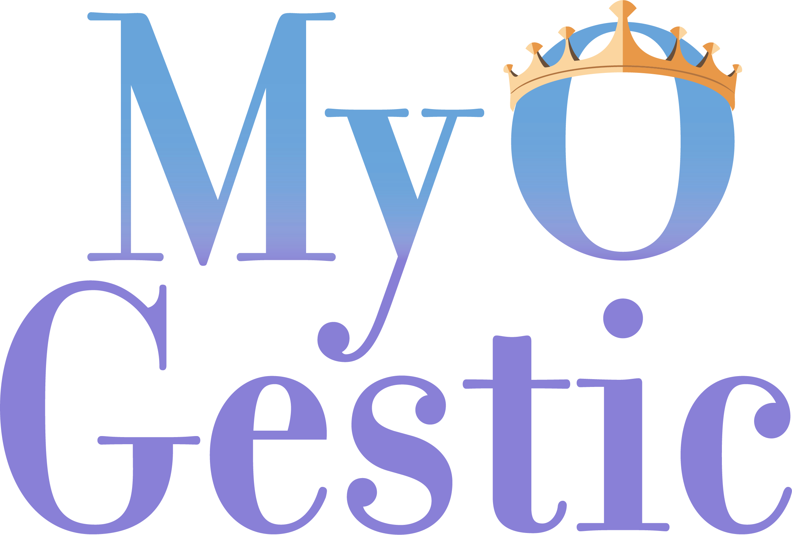
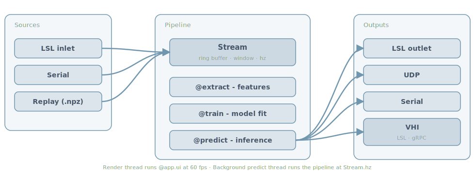

{ .home-logo .skip-lightbox }

<p class="home-tagline" markdown>
**Real-time biosignal experiment GUI builder.** A compact Python framework that turns a short script into a live experiment - signal viewers, recording, training, prediction - without classes, registries, or config files.
</p>

<div class="home-proof" markdown>

<div markdown>

```python
from myogestic import App, Stream
from myogestic.sources import LSLSource
from myogestic.widgets import RecordingControls, SignalViewer

app = App("Hello EMG")
app.streams(Stream("emg", source=LSLSource("EMG"), window_ms=1000))

viewer = SignalViewer("emg")
recording = RecordingControls(
    ["Rest", "Fist"], on_record=app.start_recording, on_stop=app.stop_recording
)


@app.ui
def ui(ctx):
    viewer.ui(ctx)
    recording.ui(ctx)


app.run()
```

That's the whole loop. Add a `Pipeline`, decorate `extract` / `train` / `predict`, and you have a closed-loop experiment.

</div>

<div markdown>

{ loading=lazy .skip-lightbox .home-screenshot }

*Live signal viewer (right) plus process launchers, recording controls, train/predict, output filter, and session manager (left). One script, one window.*

</div>

</div>

## Top-level data flow

{ .skip-lightbox loading=lazy }

Sources push samples into a `Stream` ring buffer. The pipeline's `@extract`, `@train`, `@predict` decorators read from that buffer and emit predictions to outputs - LSL, UDP, Serial, or the [Virtual Hand Interface](how-to/integrate-vhi.md) over LSL+gRPC. The render thread runs `@app.ui` at 60 fps independently of the predict thread; see [Concepts → Threading](concepts/threading.md).

<div class="playground-hero" markdown>

<div class="playground-hero__copy" markdown>

## :material-flask-outline: Try it in your browser

A live MyoGestic app running **entirely in your browser** via Pyodide. Pick a gesture, record a few seconds, train an LDA, watch the prediction flip on every click. No install, no Python on your machine, just a tab.

Pyodide + imgui-bundle WASM + scikit-learn, ~30 s first-load, cached after.

[Open the Playground :material-arrow-right:](playground/){ .md-button .md-button--primary .playground-hero__cta }

</div>

</div>

## Where to go next

<div class="grid cards" markdown>

- [:material-rocket-launch: **Getting Started**](getting-started.md) - install, run the synthetic-EMG demo
- [:material-puzzle-outline: **Anatomy of an app**](anatomy.md) - walk through one complete script in the order you write it
- [:material-school: **Guides**](tutorials/index.md) - tutorials (line-by-line walkthroughs) + how-to recipes
- [:material-graph-outline: **Concepts**](concepts/index.md) - streams, pipeline, threading, recording, design principles
- [:material-help-circle-outline: **Troubleshooting**](troubleshooting.md) - symptom-first reference for the things that go wrong
- [:material-book-open-variant: **Reference**](reference/index.md) - auto-generated API + cheatsheet + glossary

</div>

## Design principles

- No base classes, no inheritance, no registration, no config files.
- Public API fits on one page. Each widget is a single public function; implementation may split into private `_<widget>_*.py` helpers when it grows.
- Errors tell you what to write, not what went wrong.
- Plain functions with typed arguments and typed returns.
- Immediate-mode rendering - widgets are stateless function calls.

See [Design principles](concepts/design-principles.md) for the full list.
