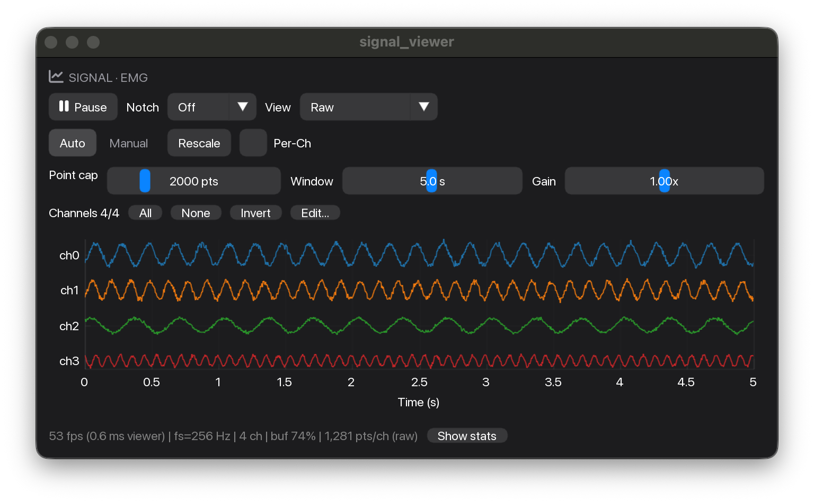
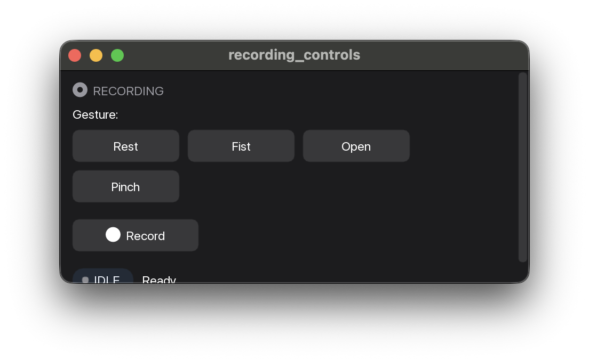
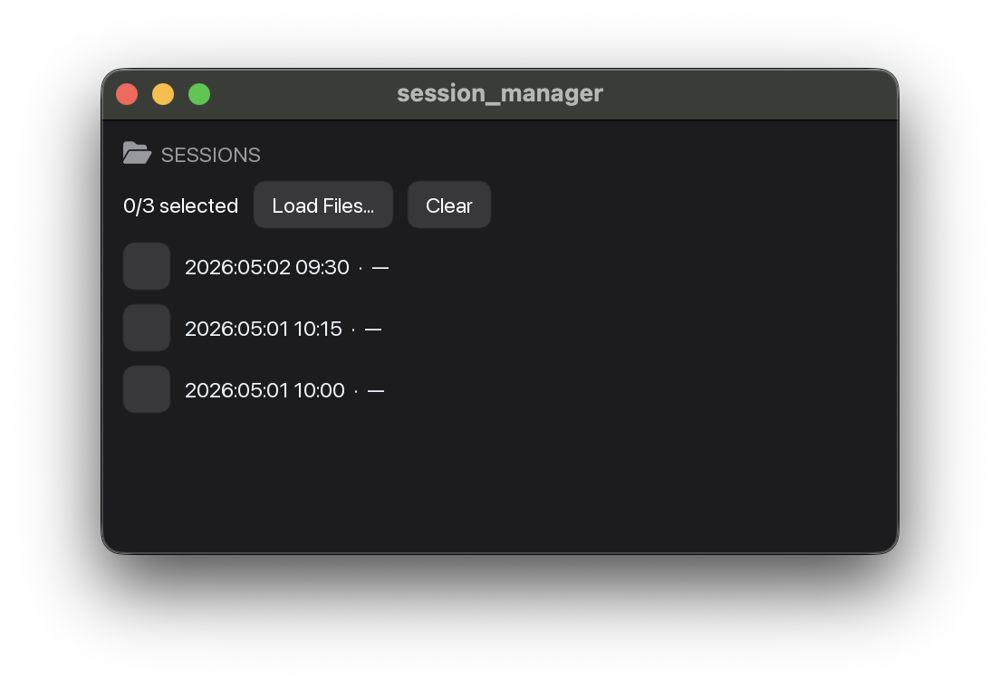
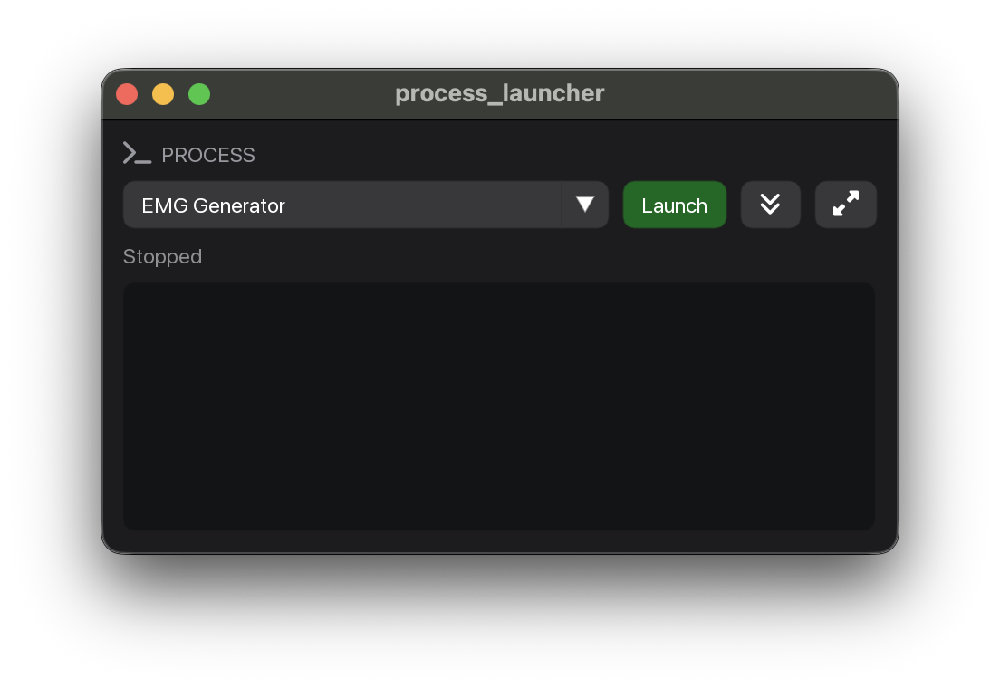
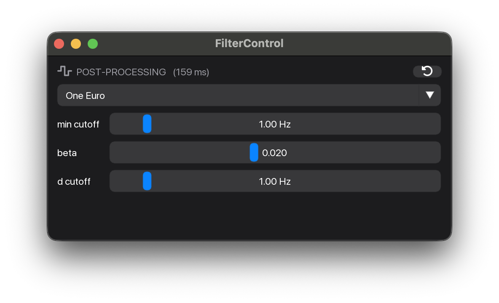
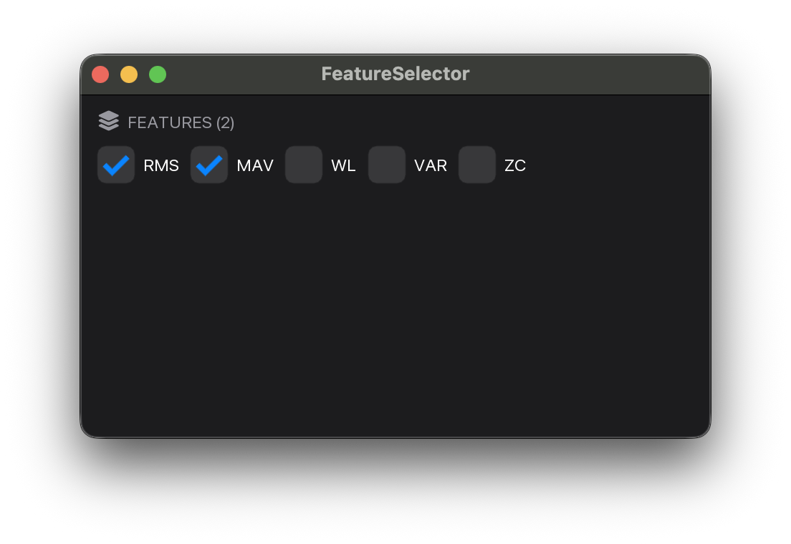
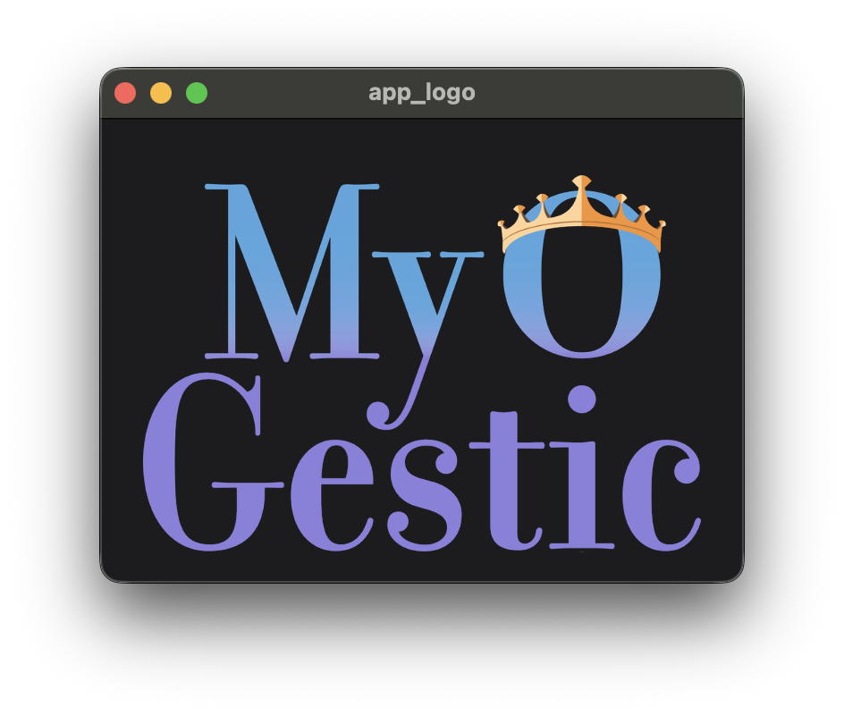
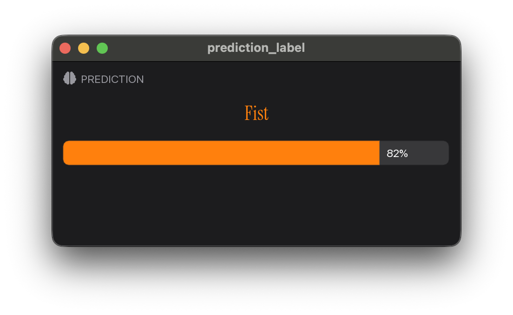
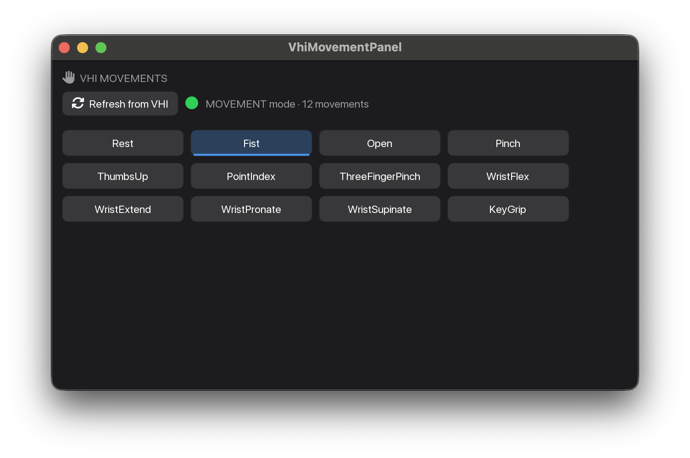

---
hide:
  - toc
---

# Widget gallery

Visual contact-sheet of every public widget. Each card shows the widget rendered in isolation.

Widgets are composable parts; a typical app combines four or five of them. See [Anatomy of an app](anatomy.md) and [Getting started](getting-started.md) for end-to-end examples that wire several widgets together.

Captured by [`tools/widget_screenshot.py`](https://github.com/NsquaredLab/MyoGestic/blob/main/tools/widget_screenshot.py) (re-run when widget styling changes):

```bash
uv run python tools/widget_screenshot.py --all
```

<div class="gallery-nav" markdown>
[Signal viewers](#signal-viewers)
[Recording & sessions](#recording-and-sessions)
[Process management](#process-management)
[ML pipeline](#ml-pipeline)
[Output processing](#output-processing)
[Feature selection](#feature-selection)
[Branding](#branding)
[ML readout](#ml-readout)
[Virtual Hand](#virtual-hand-integration)
[Other](#other-widgets)
</div>

## Signal viewers

<div class="grid cards" markdown>

-   __[SignalViewer][myogestic.widgets.SignalViewer]__

    { .widget-thumb loading=lazy }

    Renders a stream's ring buffer as a min/max envelope decimated for 60 fps. Per-channel toggles, a 50/60 Hz mains-hum notch, optional display filters (rectify, DC removal, RMS envelope), pause/rescale. Keyed by `stream_name`.

</div>

## Recording and sessions

<div class="grid cards" markdown>

-   __[RecordingControls][myogestic.widgets.RecordingControls]__

    { .widget-thumb loading=lazy }

    One button per class plus a Record toggle. Clicking a class button writes a [`LabelEvent`][myogestic.session.LabelEvent] and fires your `on_gesture` callback. Status pill shows IDLE / RECORDING.

-   __[SessionManager][myogestic.widgets.SessionManager]__

    { .widget-thumb loading=lazy }

    Browses recorded sessions (folders or `.session.zip`), lets the user tick which to include, and returns a [`TrainingData`][myogestic.TrainingData] for `@pipeline.train`. Per-row class buttons select active classes.

</div>

## Process management

<div class="grid cards" markdown>

-   __[ProcessLauncher][myogestic.widgets.ProcessLauncher]__

    { .widget-thumb loading=lazy }

    Launch / stop external subprocesses (synthetic generator, Virtual Hand, custom acquisition tools) from the GUI. Shows live state per entry; framework adopts children for clean exit.

</div>

## ML pipeline

<div class="grid cards" markdown>

-   __[PipelinePanel][myogestic.ml.widgets.PipelinePanel]__

    { .widget-thumb loading=lazy }

    Train / Predict button row plus state indicator. Buttons grey out automatically based on `pipeline.state` (no Train while Predicting). Individual buttons: [`TrainButton`][myogestic.ml.widgets.TrainButton], [`PredictButton`][myogestic.ml.widgets.PredictButton].

</div>

## Output processing

<div class="grid cards" markdown>

-   __[PostProcessor][myogestic.widgets.PostProcessor]__

    { .widget-thumb loading=lazy }

    Live-tunable post-prediction smoother (Identity / Gaussian / One Euro). Sliders tune parameters in place; Reset clears smoothing history. Pair with `output_filter(pose, timestamp=time.monotonic())` inside `@pipeline.predict`.

</div>

## Feature selection

<div class="grid cards" markdown>

-   __[FeatureSelector][myogestic.widgets.FeatureSelector]__

    { .widget-thumb loading=lazy }

    Live tickbox panel for choosing which feature transforms feed the model. Construct with `{name: callable}`; the selector concatenates active features along axis 0. Use `selector.n_active` to size architecture hyperparams.

</div>

## Branding

<div class="grid cards" markdown>

-   __[AppLogo][myogestic.widgets.panels.app_logo.AppLogo]__

    { .widget-thumb loading=lazy }

    The MyoGestic wordmark fit-to-cell with aspect preserved. Drop into a grid cell as a branding header - pairs with the square OS icon `core.py` wires into the dock / taskbar / title bar.

</div>

## ML readout

<div class="grid cards" markdown>

-   __[PredictionLabel][myogestic.widgets.training.prediction_label.PredictionLabel]__

    { .widget-thumb loading=lazy }

    Big, centred class-name readout of the current classifier output. Reads `pipeline.predictions["class"]`, colour-codes via the shared palette, optionally renders the predicted class's probability as a coloured progress bar.

</div>

## Virtual Hand integration

<div class="grid cards" markdown>

-   __[VhiMovementPanel][myogestic.widgets.vhi.panel.VhiMovementPanel]__

    { .widget-thumb loading=lazy }

    Compact VHI control palette - auto-refreshes the cached movement list from the gRPC plane (off-thread, throttled) and dispatches button clicks to `VhiControlClient.set_movement`. Highlights the current movement; greys out while disconnected.

</div>

## Other widgets

These need richer fixtures (live data, trained models, recorded trials) than the screenshot script produces, so they're listed here and documented in full on the [Widgets API](api/widgets.md) page.

<div class="other-widgets" markdown>

- **Signal & plotting**: [`RawSignalViewer`][myogestic.widgets.RawSignalViewer], [`Scatter2D`][myogestic.widgets.Scatter2D], [`Scatter3D`][myogestic.widgets.Scatter3D], [`Heatmap`][myogestic.widgets.Heatmap], [`LinePlot`][myogestic.widgets.LinePlot].
- **Training & inspection**: [`TemplateInspector`][myogestic.widgets.TemplateInspector], [`TrialPreview`][myogestic.widgets.TrialPreview].
- **ML buttons**: [`TrainButton`][myogestic.ml.widgets.TrainButton], [`PredictButton`][myogestic.ml.widgets.PredictButton], [`TrainingLog`][myogestic.ml.widgets.TrainingLog], [`SaveModelButton`][myogestic.ml.widgets.SaveModelButton], [`LoadModelButton`][myogestic.ml.widgets.LoadModelButton].
- **Status & logs**: [`StreamPanel`][myogestic.widgets.StreamPanel], [`LogPanel`][myogestic.widgets.LogPanel].
- **Layout & branding**: [`panel_header`][myogestic.widgets.panel_header], [`popout_panel`][myogestic.widgets.popout_panel], [`Image`][myogestic.widgets.Image].

</div>
